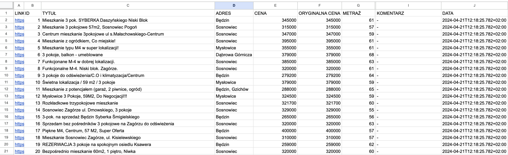
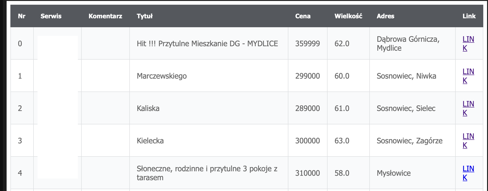

# Data-dispatcher

The Data-dispatcher is a Java application created to receive data from Kafka event and pass it to Google Sheets or send in e-mail.
The idea for application evolved from modules in [FlatFinder](https://github.com/wiktorpagacz/FlatFinder) - my other app created to scrap flat offers.

## Tech
- [Spring Boot]
- [postgreSQL]
- [Docker]
- [Google Sheets API Client]
- [Spring-Kafka]
- [jakarta-mail-api]
- [Mapstruct]
- [Apache Avro]

Example results of using the application are below.<br>
Google sheet:

Mail:


> The above examples were created by running [FlatFinder](https://github.com/wiktorpagacz/FlatFinder) simultaneously as a source of data

## Installation:

1. Pull the repository and open `google-sheets-module` and then navigate to the [src/main/java/com/pagacz/gsheet](google-sheets-module/src/main/java/com/pagacz/gsheet). Create a new directory `utils` with class `SheetProps` in it
   - in the newly created class declare 4 Strings with access data to Google Cloud (required in [SheetServiceFactory.java](google-sheets-module/src/main/java/com/pagacz/gsheet/service/SheetServiceFactory.java))
     > You have to create a new project on [GCP](https://console.cloud.google.com/) then enable [Google Sheets API](https://console.cloud.google.com/flows/enableapi?apiid=sheets.googleapis.com) and create new Login data. 
     The path to the token file saved as a *.json will be first parameter _(String credFilePath)_ in the constructor of [GoogleSheetService](google-sheets-module/src/main/java/com/pagacz/gsheet/service/GoogleSheetService.java).

2. Build the project by executing in the terminal: 
   ```sh
   ./gradlew clean build
   ```
3. Set the environment variables to the docker container in the [local docker directory](gateway/docker/local2) of gateway module
4. If you want to use email-module make sure to configure all mail props in application.properties file, if not comment out the @Scheduled annotation over sendOffersByEmail method in the [TaskScheduler](gateway/src/main/java/com/pagacz/gateway/application/scheduler/TaskScheduler.java) service.
5. Create a new Run Configuration in IntelliJ
   - add the environment variables listed below or install [devEnv](https://plugins.jetbrains.com/plugin/7861-envfile) plugin and load [local.env](gateway/docker/local/local.env) file: 
     - SPRING_DATASOURCE_USERNAME
     - SPRING_DATASOURCE_PASSWORD
     - EMAIL_NAME
     - EMAIL_PASS
     - EMAIL_RECIPIENTS
   - Classpath to run: `data-dispatcher.gateway.run`
   - Name of class with main: `com.pagacz.gateway.application.DataDispatcherApplication`
6.  Make sure to enable annotation processing in IntelliJ -
check a box under Settings > Build, Execution, Deployment > Compiler > Annotation Processors
7. Launch the terminal and navigate to the 
    ```sh
    gateway/docker/local/
    ```
8. Make sure to have running Docker application and execute a command in the terminal:
   ```sh
   docker-compose up -d
   ```
   It will run docker container in detached mode
9. If the container for the database and other components runs successfully, you can now run the application through the IDE

[Spring Boot]: <https://github.com/spring-projects/spring-boot>
[Google Sheets API Client]: <https://github.com/googleapis/google-api-java-client-services/tree/main/clients/google-api-services-sheets/v4>
[Apache Avro]: <https://avro.apache.org>
[Mapstruct]: <https://mapstruct.org>
[jakarta-mail-api]: <https://github.com/jakartaee/mail-api>
[Spring-Kafka]: <https://github.com/spring-projects/spring-kafka>
[Docker]: <https://www.docker.com>
[postgreSQL]: <https://www.postgresql.org>